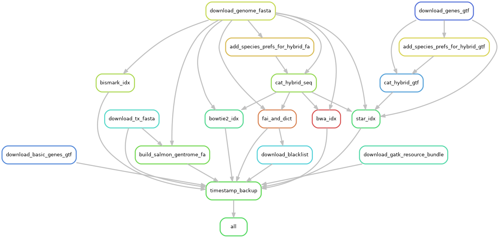

# prep_bbc_shared

This is a Snakemake pipeline for preparing index files and other shared resources for use in the BBC at VAI. The goal is to automate and standardize the creation of index files for a number of different tools and across different species.

## How to run
`qsub -q bbc src/run_snakemake.sh`

## Directory structure
The file structure is:

* Date of creation
    * hg38_gencode
        * sequence
            * sequence.fa
            * sequence.fa.fai
            * sequence.fa.dict
        * annotation
            * genes.gtf
        * indexes
            * star/
            * bwa/
    * mm10_gencode
        * sequence
            * sequence.fa
            * sequence.fa.fai
            * sequence.fa.dict
        * annotation
            * genes.gtf
        * indexes
            * star/
            * bwa/

## The 'species' file

The pipeline is guided by a 'species' file that specifies the URLs for the genome fastas and the gene annotations, and could be augmented to include other things for future rules. The current columns are:

1. species
2. id
3. genome_fasta
4. gene_gtf

The layout of this file and the pipeline allows for stright-forward the specification of different variants of references for the same species. For example, there could be a row for 'human hg38_ensembl' and another row for 'human hg19_ensembl' in the species file. This would result in the creation of two sub-directories: 'hg38_ensembl' and 'hg19_ensembl', with their own genome fastas, annotation files and index files.

One may wish to make a nonstandard variation of the hg38 reference using a customized genome fasta. In this case, one could supply the genome fasta file manually in the appropriately named subdirectory and the Snakemake pipeline would skip the fasta downloading rule. Similarly, one could use a custom GTF and move it manually into the appropriate subdirectory and the pipeline will skip downloading the GTF. One could also place a symlink in place of the fasta or GTF files.

## The workflow

